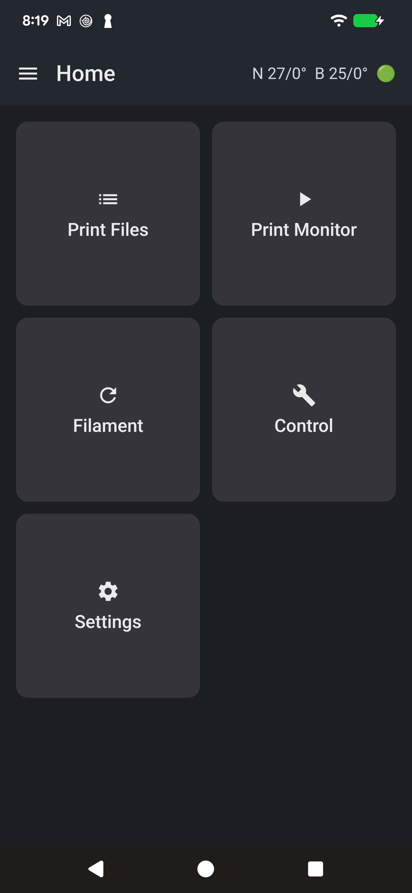
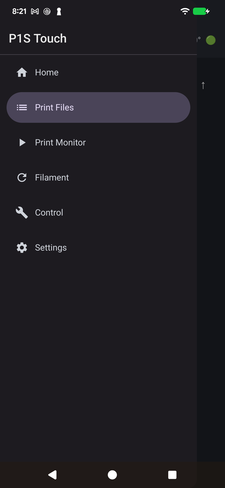
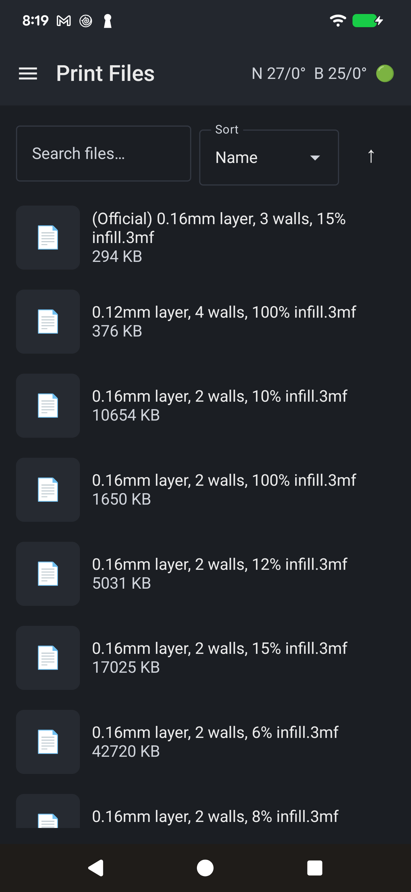

# P1S Touch Screen (Android)

A native Kotlin/Jetpack Compose Android app that controls a Bambu Lab P1S
over the local network, for a tablet or phone instead of a dedicated
kiosk. Talks to the printer over Bambu's LAN-mode MQTT/FTP protocol,
using a Material3 side-drawer navigation layout. This is a from-scratch
Kotlin port of [p1sTouchScreen-RPI](https://github.com/yaturner/p1sTouchScreen-RPI),
the original PySide6 app for a Raspberry Pi + touchscreen; the two share
the same protocol know-how but no code.

Screens: Home, Print Files (browse/search/sort real files off the
printer, 3MF thumbnails, tap to start a print -- verified live), Print
Monitor (live camera feed, progress/layer/ETA, pause/resume/stop, speed
-- verified live), Filament/AMS (placeholder, not built yet), Control
(jog/home/extrude/fans/light/temps), Settings.

**Status: active work in progress**, not yet feature-complete. MQTT
(live telemetry, all Control commands), FTP (file listing, thumbnails,
starting a print), and the camera stream all work and have been
verified against a real printer. Not yet done: the Filament/AMS screen.

**Print Files can be slow to load thumbnails the first time.** This
printer's FTP transfer speed over FTPS is slow in practice (tens of KB/s,
not the multi-MB/s you'd expect on a LAN -- likely the printer's own
embedded CPU being the bottleneck for the TLS overhead, not the network),
so downloading and caching a preview image for every file in a large
library can take several minutes the first time you open Print Files.
Thumbnails are cached to disk afterward, so this is a one-time cost per
file (until it's re-sliced/re-uploaded). If you'd rather skip this
entirely, turn on **Skip thumbnails** in Settings -- Print Files will
still list every file, just without previews.

## Screenshots

| Home | Side-drawer nav | Print Files |
| --- | --- | --- |
|  |  |  |

## Disclaimer / limitation of liability

This is an independent, unofficial hobby project, not affiliated with or
endorsed by Bambu Lab. It sends real commands to a real 3D printer,
including heater setpoints, motion, and print start/stop -- software bugs,
network issues, or misuse can cause failed prints, wasted material,
damage to the printer, or in the worst case a fire or other property
damage or injury if the printer is left unattended or its own safety
features are disabled or malfunction.

**This software is provided "as is", without warranty of any kind,
express or implied.** By downloading, installing, or using this software
you agree that you do so entirely at your own risk, and that the author(s)
and contributors shall not be liable for any claim, damages, or other
liability -- whether in an action of contract, tort, or otherwise --
arising from, out of, or in connection with the software or the use or
other dealings in the software, including but not limited to damage to
your printer, your property, or any other property, or personal injury.
You are solely responsible for supervising your printer and for complying
with your printer manufacturer's safety guidance while using this or any
third-party control software.

Always follow standard 3D printer safety practice: use a smoke/fire
detector near the printer, don't leave it printing unattended for long
periods, and use a printer that itself has functioning thermal-runaway
protection.

## Printer setup (required)

This app only works over Bambu's **local network (LAN) protocol** -- it
does not use Bambu's cloud. On the printer itself (screen or Bambu
Studio/Handy), under network settings, enable:

- **LAN Only Mode** -- required for any local connection at all. Enabling
  it shows the printer's **IP address**, **access code**, and **serial
  number**, which you enter into the app's first-run/Settings screen.
  Note this also disconnects the printer from Bambu's cloud service --
  you won't be able to use the cloud-based Bambu Handy app or cloud
  slicing while it's on.
- **Developer Mode** -- required in addition to LAN Only Mode for the
  Control screen's homing, jog, extrude, and fan commands (these go over
  raw G-code MQTT commands that the printer only accepts in Developer
  Mode). Print Files and Filament/AMS work with LAN Only Mode alone, but
  turn Developer Mode on too unless you specifically want the Control
  screen disabled.

Both toggles are printer settings, not app settings -- re-enable them
after any printer firmware update if they get reset.

## Setup

Requires Android Studio (or the command-line tools) with SDK 36 and JDK
17, and a device or emulator running Android 8.0 (API 26) or later.

```bash
git clone https://github.com/yaturner/p1sTouchScreen-Android.git
cd p1sTouchScreen-Android
./gradlew assembleDebug
```

Install onto a connected device/emulator:

```bash
./gradlew installDebug
```

On first launch, either connect to **Mock** (synthetic data, no printer
needed -- handy for trying out the UI) or enter your printer's IP,
access code, and serial number from its LAN Only Mode screen (see
"Printer setup" above). The choice is saved and can be changed later from
Settings.

## License

[MIT](LICENSE)
